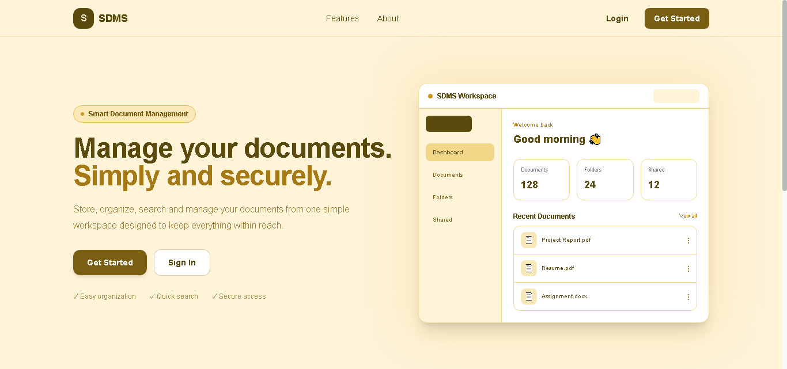
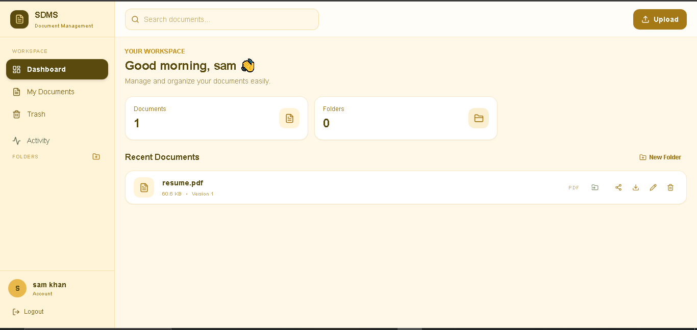
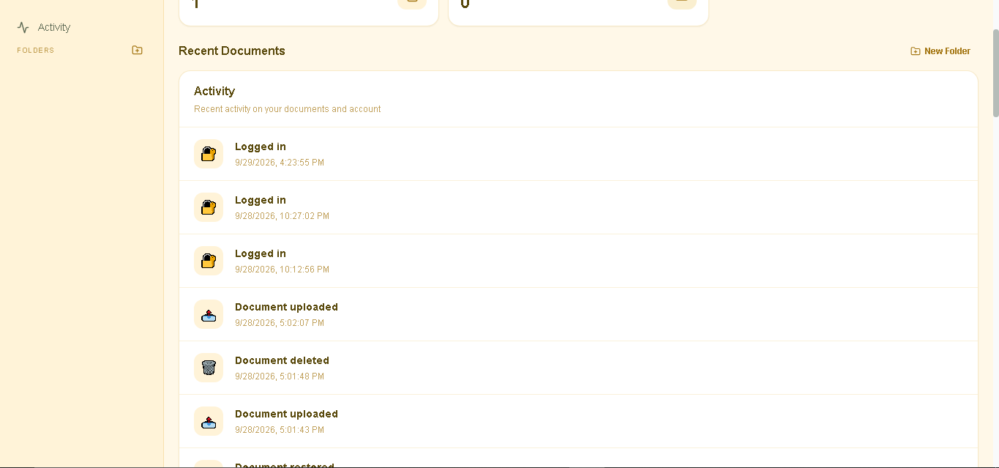

# 🔐 SDMS — Secure Document Management System

A full-stack document management platform designed to securely **upload, organize, share, version, and audit documents** with role-based access control and cloud storage.

> A secure document management system built with the MERN stack, Next.js, and cloud-based file storage.

---

## 🌐 Overview

**SDMS (Secure Document Management System)** is a full-stack web application that allows users to securely manage their documents from a centralized dashboard.

The system provides:

- 🔐 JWT-based authentication
- 👤 Role-based access control
- 📁 Document and folder management
- 🤝 Permission-based document sharing
- ⏳ Share expiration
- 🗂️ Document version history
- 🔎 Search, filtering, and pagination
- 📋 Activity and audit logging
- ☁️ Cloud-based file storage
- 🛡️ Multiple security layers

The application uses **Next.js** for the frontend, **Node.js and Express.js** for the REST API, **MongoDB** for structured data, and **Cloudinary** for file storage.

---

## 📸 UI Preview

### 🏠 Landing Page



### 📂 Dashboard



### 📋 Activity



---

## ✨ Features

### 🔐 Authentication & Security

- JWT-based authentication
- Password hashing with bcrypt
- Role-based access control (`user` / `admin`)
- Rate-limited authentication endpoints
- Ownership and permission checks for document operations
- Centralized error handling
- Security headers with Helmet
- NoSQL injection protection
- Environment variables for sensitive configuration

---

### 📄 Document Management

Users can:

- Upload documents
- Rename documents
- Download documents
- Soft-delete documents
- Organize documents into folders
- Move documents between folders
- Search documents
- Filter documents by type and folder
- Upload new versions of existing documents

Files are stored in **Cloudinary**, while MongoDB stores document metadata and storage references.

---

### 📁 Folder Management

- Create folders
- Rename folders
- Delete folders
- Move documents between folders
- Prevent deletion of non-empty folders

Folder deletion is blocked while documents are still associated with the folder.

---

### 🤝 Sharing & Permissions

Documents can be shared with other registered users using their email address.

Supported permission levels:

| Permission | Access |
|---|---|
| `view` | View document information |
| `download` | View and download document |
| `edit` | Modify document |

Sharing also supports:

- Viewing active shares
- Revoking access
- Optional share expiration
- Permission validation on protected operations

---

### 🗂️ Version History

SDMS maintains previous versions of documents instead of simply replacing the existing file.

- Initial upload creates **Version 1**
- Uploading a new version increments the version number
- Previous versions remain preserved
- Version history can be retrieved for each document

---

### 🔎 Search

Documents can be:

- Searched case-insensitively
- Filtered by file type
- Filtered by folder
- Paginated

---

### 📋 Activity & Audit Logging

Sensitive actions are recorded in the activity/audit log.

Logged actions can include:

- Login
- Upload
- Download
- Share
- Rename
- Delete
- Version upload
- Other sensitive document operations

Each activity record contains information such as the acting user and timestamp.

---

## 🏗️ Architecture

```text
┌──────────────────────┐
│    Next.js Frontend  │
│  React + Tailwind    │
└──────────┬───────────┘
           │
           │ REST API
           ▼
┌──────────────────────┐
│    Express.js API    │
│                      │
│ Authentication       │
│ Authorization        │
│ Business Logic       │
│ Validation           │
└───────┬────────┬─────┘
        │        │
        ▼        ▼
┌────────────┐  ┌──────────────┐
│  MongoDB   │  │  Cloudinary  │
│            │  │              │
│ Users      │  │ File Storage │
│ Documents  │  │              │
│ Folders    │  │              │
│ Shares     │  │              │
│ Versions   │  │              │
│ Audit Logs │  │              │
└────────────┘  └──────────────┘
```

### Data Storage

**MongoDB** stores structured application data:

- Users
- Documents
- Folders
- Shares
- Versions
- Audit logs

**Cloudinary** stores the actual uploaded files.

MongoDB stores references to the files rather than storing the file bytes directly.

---

## 🛡️ Permission Model

Protected document operations follow an authorization flow:

```text
Request
   │
   ▼
Authenticated User?
   │
   ├── No ──► Reject
   │
   ▼
Is User the Owner?
   │
   ├── Yes ──► Allow
   │
   ▼
Active Share Exists?
   │
   ├── No ──► Reject
   │
   ▼
Required Permission?
   │
   ├── No ──► Reject
   │
   ▼
Share Still Active?
   │
   ├── No ──► Reject
   │
   ▼
Allow Operation
```

This ensures that access to protected resources is explicitly authorized.

---

## 🛠️ Tech Stack

| Layer | Technology |
|---|---|
| Frontend | Next.js, React, Tailwind CSS, Three.js |
| Backend | Node.js, Express.js |
| Database | MongoDB, Mongoose |
| Authentication | JWT, bcrypt |
| File Storage | Cloudinary |
| File Uploads | Multer |
| Security | Helmet, CORS, express-rate-limit, express-mongo-sanitize |

---

## 📁 Project Structure

```text
sdms/
│
├── backend/
│   └── src/
│       ├── config/          # Database & Cloudinary configuration
│       ├── controllers/     # Business logic
│       ├── middleware/      # Authentication, authorization, uploads & errors
│       ├── models/          # Mongoose schemas
│       ├── routes/          # Express API routes
│       ├── services/        # Storage & audit services
│       └── utils/           # JWT & permission helpers
│
├── frontend/
│   ├── app/                 # Next.js App Router pages
│   ├── components/          # Reusable UI components
│   └── lib/                 # API client & authentication utilities
│
├── screenshots/
│   ├── landing-page.png
│   ├── dashboard.png
│   └── activity.png
│
└── README.md
```

---

## 🔌 API Overview

### Authentication

| Method | Endpoint | Description |
|---|---|---|
| `POST` | `/api/auth/register` | Create an account |
| `POST` | `/api/auth/login` | Authenticate user |
| `GET` | `/api/auth/me` | Get current authenticated user |

### Documents

| Method | Endpoint | Description |
|---|---|---|
| `POST` | `/api/documents` | Upload a document |
| `GET` | `/api/documents` | List/search documents |
| `GET` | `/api/documents/:id` | Get document details |
| `PUT` | `/api/documents/:id` | Rename/move document |
| `DELETE` | `/api/documents/:id` | Soft-delete document |
| `GET` | `/api/documents/:id/download` | Get secure download link |

### Sharing

| Method | Endpoint | Description |
|---|---|---|
| `POST` | `/api/documents/:id/share` | Share document |
| `GET` | `/api/documents/:id/shares` | List document shares |
| `DELETE` | `/api/documents/:id/shares/:userId` | Revoke access |

### Versions

| Method | Endpoint | Description |
|---|---|---|
| `POST` | `/api/documents/:id/versions` | Upload a new version |
| `GET` | `/api/documents/:id/versions` | Get version history |

### Folders

| Method | Endpoint | Description |
|---|---|---|
| `POST` | `/api/folders` | Create folder |
| `GET` | `/api/folders` | List folders |
| `PUT` | `/api/folders/:id` | Rename folder |
| `DELETE` | `/api/folders/:id` | Delete folder |

### Activity

| Method | Endpoint | Description |
|---|---|---|
| `GET` | `/api/audit-logs` | View activity history |

---

## 🚀 Getting Started

### Prerequisites

Make sure you have:

- Node.js installed
- MongoDB Atlas account
- Cloudinary account
- Git

---

### 1. Clone the Repository

```bash
git clone <https://github.com/Samiyakhan17/SDMSystem,>
cd sdms
```

---

### 2. Backend Setup

```bash
cd backend
npm install
```

Create your environment file:

```bash
cp .env.example .env
```

Add your configuration:

```env
MONGODB_URI=your_mongodb_connection_string
JWT_SECRET=your_jwt_secret

CLOUDINARY_CLOUD_NAME=your_cloud_name
CLOUDINARY_API_KEY=your_api_key
CLOUDINARY_API_SECRET=your_api_secret
```

Start the backend:

```bash
npm run dev
```

---

### 3. Frontend Setup

Open another terminal:

```bash
cd frontend
npm install
```

Create your environment file:

```bash
cp .env.local.example .env.local
```

Start the frontend:

```bash
npm run dev
```

The application will be available at:

```text
http://localhost:3000
```

---

## 🔒 Security Highlights

SDMS uses multiple layers of security throughout the application.

### Authentication

- Passwords are never stored in plaintext
- Passwords are hashed using bcrypt
- JWT is used for authentication
- Protected routes require authentication

### Authorization

Sensitive document operations verify:

```text
Authenticated User
        ↓
Resource Ownership
        ↓
Active Share
        ↓
Required Permission
        ↓
Share Expiration
```

### API Security

- Helmet security headers
- CORS configuration
- Authentication rate limiting
- NoSQL injection protection
- Centralized error handling
- Sensitive configuration stored in environment variables

---

## ☁️ File Storage

SDMS separates application metadata from file storage.

```text
User uploads document
          │
          ▼
        Multer
          │
          ▼
      Cloudinary
          │
          ▼
     File reference
          │
          ▼
       MongoDB
```

The application server does not permanently store uploaded documents. Cloudinary handles the actual file storage while MongoDB stores the associated metadata and references.

---

## 🎨 Frontend

The frontend is built using:

- Next.js App Router
- React
- Tailwind CSS
- Three.js

The interface provides:

- Document management
- Folder organization
- File uploads
- Document sharing
- Permission management
- Version management
- Activity history
- Search and filtering

---

## 🔮 Future Improvements

Potential future improvements include:

- [ ] Admin analytics dashboard
- [ ] Bulk document operations
- [ ] Advanced document preview
- [ ] Email notifications for document sharing
- [ ] More granular permission management
- [ ] Automated testing
- [ ] CI/CD pipeline
- [ ] Additional storage providers
- [ ] Document activity timeline
- [ ] Improved mobile experience

---

## 📌 Project Status

**Status: ✅ Completed**

SDMS currently provides secure document storage, organization, sharing, permission management, version history, search, and activity logging through a full-stack web application.

---

👩‍💻 Author

Samiya Khan

Built as a full-stack project focused on backend engineering, API development, and modern web application development.